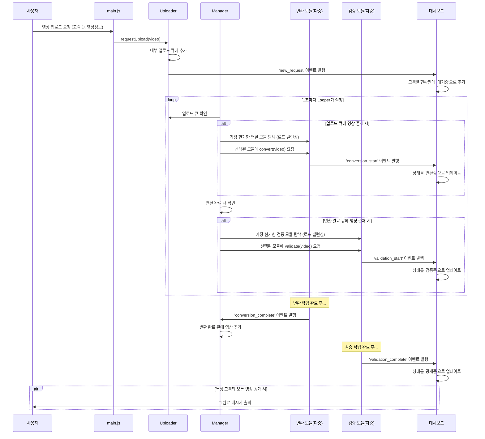

# 🎬 Day 11-12: 비동기 동영상 처리 파이프라인 시뮬레이터

## 🎯 미션 목표

이번 미션은 동영상 서비스의 백엔드에서 일어나는 복잡한 비동기 처리 과정을 시뮬레이션하는 것을 목표로 합니다. 사용자가 업로드한 여러 개의 영상이 **등록 → 변환 → 검증 → 공개**되는 전체 파이프라인을 구축합니다

특히, 실제 스레드를 생성하는 방식이 아닌, 이벤트 큐와 이벤트 루프를 활용하여 여러 작업을 병렬적으로 처리하는 방식을 학습합니다. 이를 통해 대규모 요청을 효율적으로 처리하는 확장성 있는 시스템 설계 역량을 기릅니다.

---

## 🚀 구현 과정 및 결과

### Mission 1: 기본 파이프라인 구축

1.  **모듈 설계**: `Uploader`, `Converter`, `Validator`, `Dashboard`, `Looper` 등 각 클래스가 단일 책임을 갖도록 설계했습니다.
2.  **이벤트 기반 설계**: `EventEmitter`를 상속받아 각 모듈이 이벤트를 발행(emit)하고 구독(on)하는 방식으로 통신하도록 구현했습니다. 예를 들어, `Converter`는 변환이 완료되면 `conversion_complete` 이벤트를 발행하고, `main.js`에 설정된 리스너가 이를 받아 `Validator`에게 작업을 넘겨줍니다.
3.  **비동기 시뮬레이션**: `setTimeout`을 사용하여 실제 작업처럼 시간이 소요되는 비동기 동작을 구현했습니다.
4.  **상태 시각화**: `Looper`가 1초마다 `Dashboard`의 `print` 메소드를 호출하여, 모든 영상의 현재 상태(`대기중`, `변환중` 등)를 터미널에 지속적으로 업데이트하도록 구현했습니다.

### Mission 2: 파이프라인 확장 및 고도화

1.  **동적 모듈 생성**: 프로그램 시작 시 `readline`으로 변환/검증 모듈 개수를 입력받아, 해당 개수만큼 `Converter`와 `Validator` 인스턴스를 배열로 생성하도록 `main.js`를 수정했습니다.
2.  **Manager 도입 및 로드 밸런싱**: `UploadManager`를 `Manager`로 확장하여, 업로드 큐뿐만 아니라 변환 완료 큐까지 관리하도록 했습니다. `Manager`는 `reduce` 메소드를 사용하여 현재 작업 대기 큐가 가장 짧은 모듈(`Converter` 또는 `Validator`)을 찾아 작업을 할당하는 **로드 밸런싱** 로직을 구현했습니다.
3.  **Converter 성능 향상**: `Converter` 클래스 내부의 `isBusy` 플래그를 `processingCount`와 `capacity` 변수로 대체하여, 동시에 2개의 영상을 처리할 수 있도록 로직을 수정했습니다.
4.  **고객별 현황판**: `Dashboard`의 자료구조를 `Map`에서 고객 ID를 키로 갖는 객체로 변경했습니다. 이를 통해 고객별로 업로드한 영상들을 그룹화하여 출력하고, 특정 고객의 모든 영상이 `공개중` 상태가 되면 완료 메시지를 출력하는 기능을 구현했습니다.

---

## 📊 시스템 아키텍처 및 데이터 흐름

본 시뮬레이터는 여러 모듈이 이벤트를 통해 상호작용하는 이벤트 기반 아키텍처로 설계되었습니다. 전체적인 데이터 흐름은 아래 다이어그램과 같습니다.

---
