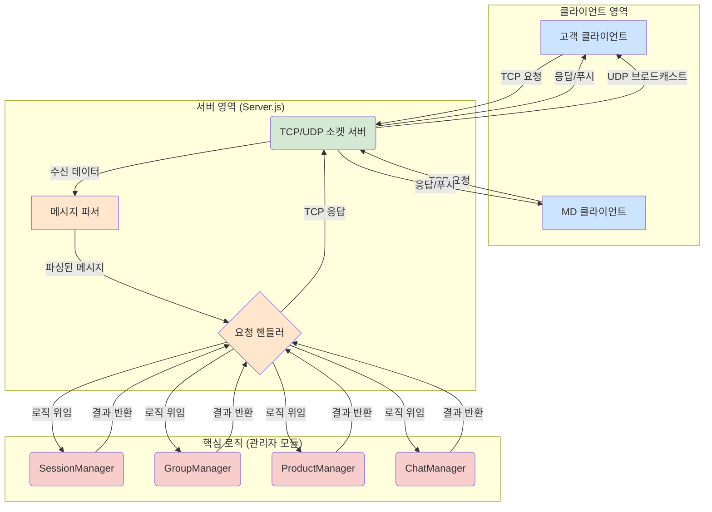

# 🚀 Day18-19: TCP/UDP 소켓 기반 쇼핑몰 서버 및 클라이언트 구현

## 1. 🎯 미션 목표

Node.js의 `net` 및 `dgram` 모듈을 활용하여, 여러 클라이언트의 동시 접속과 상태를 관리하는 TCP 서버를 구축하고, 실시간 메시지 전송을 위한 UDP 통신을 구현합니다. 이를 통해 TCP/UDP 네트워크 프로그래밍의 핵심 원리를 이해하고, 상태 기반의 비동기 서버 애플리케이션 설계 및 구현 능력을 기릅니다.

---

## 2. 🏛️ 시스템 아키텍처 설계

본격적인 구현에 앞서, 시스템을 구성하는 핵심 요소들을 **관심사 분리(Separation of Concerns)** 원칙에 따라 모듈화했습니다. 각 모듈은 독립적인 책임을 가지며, 이를 통해 코드의 유지보수성과 확장성을 높이고자 했습니다.



- **클라이언트 영역:** 사용자와 직접 상호작용하는 UI. 고객용과 MD용으로 나뉩니다.
- **서버 영역:** 클라이언트의 연결을 수락하고, 데이터를 받아 파싱한 후, 적절한 핸들러에게 처리를 위임하는 관문 역할을 합니다.
- **핵심 로직 (관리자 모듈):** 실제 비즈니스 로직을 수행하는 두뇌입니다. 각 관리자 모듈은 세션, 그룹, 상품, 채팅과 같이 명확하게 구분된 책임을 가집니다.

---

## 3. 🔧 통신 프로토콜 설계

TCP는 데이터의 경계를 구분해주지 않는 스트림(Stream) 기반 프로토콜이므로, 안정적인 통신을 위해 직접 애플리케이션 레벨의 프로토콜을 설계했습니다.

- **기본 구조:** `헤더` + `구분자` + `본문(JSON)`
- **헤더:** `Content-Length: <바이트 단위 길이>` 형식으로, 메시지 본문의 정확한 길이를 명시합니다.
- **구분자:** `\r\n\r\n`을 사용하여 헤더와 본문을 명확하게 분리합니다.
- **본문:** 모든 요청과 응답은 `JSON` 형식으로 직렬화하여, 다양한 구조의 데이터를 유연하게 처리할 수 있도록 했습니다.

### 3.1. 요청 (Request) 형식

```
Content-Length: <LENGTH>\r\n\r\n{"type":"<REQUEST_TYPE>","payload":{...}}
```

### 3.2. 응답 (Response) 형식

```
Content-Length: <LENGTH>\r\n\r\n{"status":"<STATUS>","type":"<RESPONSE_TYPE>","payload":{...}}
```

---

## 4. 💡 핵심 구현 로직 및 트러블슈팅

### 4.1. 안정적인 메시지 파서 (`parser.js`)

- **문제점:** 초기 구현 시, 한글과 같은 멀티바이트 문자가 포함될 경우 `Content-Length`(바이트 단위)와 실제 문자열의 길이가 달라 메시지 파싱에 실패하는 치명적인 오류가 있었습니다. 또한, 데이터가 나뉘어 도착하는 경우를 제대로 처리하지 못해 클라이언트가 서버의 응답을 받지 못하는 문제가 발생했습니다.

- **해결책:** 문자열이 아닌, **데이터의 기본 단위인 `Buffer`를 직접 다루는 방식**으로 파서 로직을 전면 재작성했습니다.
    1.  새로운 데이터가 도착하면 기존 버퍼에 `Buffer.concat()`으로 합칩니다.
    2.  버퍼에서 `indexOf`를 사용해 구분자(`\r\n\r\n`)의 위치를 찾습니다.
    3.  헤더를 파싱하여 `Content-Length`를 얻고, 메시지 전체가 버퍼에 도착했는지 바이트 단위로 정확히 확인합니다.
    4.  완성된 메시지만큼 버퍼에서 `slice()`하여 추출하고, 나머지는 다음 데이터 수신을 위해 버퍼에 남겨둡니다.
    
    이 방식을 통해 어떤 경우에도 메시지를 유실하거나 잘못 조립하는 일 없이 안정적으로 처리할 수 있게 되었습니다.

### 4.2. 상태 기반 서버 관리 로직

- **`SessionManager.js`:**
    - `Map`을 사용하여 각 클라이언트의 `socket` 객체를 키(key)로, 세션 정보(ID, 로그인 상태, campId, groupId)를 값(value)으로 저장하여 1:1로 관리합니다.
    - **중복 로그인 방지:** `Set` 자료구조인 `loggedInCampIds`를 추가로 두어, 새로운 로그인 요청이 올 때마다 해당 `campId`가 이미 Set에 존재하는지 확인하여 중복 접속을 원천적으로 차단합니다.
    - 클라이언트의 연결이 끊어지면(`close` 이벤트), 해당 `campId`를 Set에서 제거하여 다른 사용자가 접속할 수 있도록 합니다.

- **`GroupManager.js`:**
    - `Map`을 사용하여 그룹 ID를 키로, 해당 그룹에 속한 `campId`들의 `Set`을 값으로 저장합니다.
    - 새로운 로그인 요청 시, 4명 미만의 그룹을 먼저 탐색하여 빈자리에 사용자를 배치하고, 빈자리가 없으면 새로운 그룹을 생성하여 자원의 낭비를 최소화합니다.

### 4.3. 다중 클라이언트 UDP 포트 공유

- **문제점:** 여러 고객 클라이언트를 실행하면, 두 번째 클라이언트부터 UDP 포트(41234)를 이미 사용 중이라는 `EADDRINUSE` 오류가 발생했습니다.

- **해결책:** `dgram.createSocket()` 호출 시, `reuseAddr: true` 옵션을 추가했습니다.
    ```javascript
    const udpClient = dgram.createSocket({ type: 'udp4', reuseAddr: true });
    ```
    이 옵션은 다른 프로세스가 동일한 포트를 사용하고 있더라도, 자신도 해당 포트를 함께 사용할 수 있도록 허용하여 여러 클라이언트가 동시에 브로드캐스트 메시지를 수신할 수 있게 해줍니다.

---

## 5. 모듈별 핵심 로직 상세 설명

### 5.1. `parser.js` - 안정적인 메시지 수신기

TCP 통신에서 가장 중요한 부분은 데이터 스트림에서 완전한 메시지를 정확히 분리해내는 것입니다. `MessageParser`는 이 역할을 수행하는 핵심 모듈입니다.

- **`constructor(onMessage)`**: 파서가 완전한 메시지를 조립했을 때, 이를 처리할 콜백 함수(`onMessage`)를 인자로 받습니다. 이 구조를 통해 파서는 메시지 조립 책임만 지고, 조립된 메시지의 처리는 외부(서버, 클라이언트)에 위임합니다.

- **`parse(data)`**: `Buffer`를 직접 다루어 데이터 수신 시 발생하는 모든 경계 문제를 해결합니다.
    1.  **버퍼 통합**: 새로 도착한 데이터(`data`)를 기존 버퍼(`this.buffer`)에 `Buffer.concat()`으로 합쳐, 메시지가 나뉘어 도착하더라도 완전한 데이터로 만듭니다.
        ```javascript
        this.buffer = Buffer.concat([this.buffer, data]);
        ```
    2.  **메시지 루프**: 버퍼에 여러 메시지가 한꺼번에 도착할 수 있으므로, `while` 루프를 통해 버퍼에 처리할 메시지가 없을 때까지 계속해서 파싱을 시도합니다.
    3.  **헤더/본문 분리**: `indexOf('\r\n\r\n')`를 사용해 헤더와 본문의 경계를 찾고, 헤더에서 `Content-Length`를 추출합니다.
    4.  **메시지 완성 확인**: `Content-Length`를 바탕으로 메시지 전체가 버퍼에 도착했는지 바이트 단위로 정확히 검사합니다. 데이터가 부족하면 파싱을 중단하고 다음 데이터 수신을 기다립니다.
        ```javascript
        if (this.buffer.length < messageEndIndex) {
            break; // 아직 메시지가 다 도착하지 않음
        }
        ```
    5.  **메시지 처리 및 버퍼 정리**: 완성된 메시지는 `slice()`로 추출하여 `onMessage` 콜백으로 전달하고, 처리된 부분은 버퍼에서 제거하여 메모리 누수를 방지합니다.
        ```javascript
        this.buffer = this.buffer.slice(messageEndIndex);
        ```

### 5.2. `server.js` 

서버의 메인 파일로, 클라이언트의 연결을 관리하고 모든 요청을 적절한 관리자 모듈에 분배하는 컨트롤 타워 역할을 합니다.

- **`net.createServer((socket) => { ... })`**: 클라이언트가 접속할 때마다 새로운 `socket` 객체가 생성되며, 이 `socket` 하나가 클라이언트와의 통신 채널이 됩니다. 각 소켓마다 독립적인 `MessageParser` 인스턴스를 생성하여 클라이언트별로 메시지 수신을 관리합니다.
    ```javascript
    const parser = new MessageParser((message) => {
        handleRequest(socket, message);
    });
    socket.on('data', (data) => parser.parse(data));
    ```
- **`handleRequest(socket, message)`**: 파싱된 메시지를 받아 `type`에 따라 `switch` 문으로 분기하여, 실제 비즈니스 로직 처리를 `SessionManager`, `ProductManager` 등 담당 모듈에 위임합니다.

- **`socket.on('close', ...)`**: 클라이언트의 연결이 비정상적으로 끊어졌을 때 발생하는 이벤트입니다. 여기서 해당 사용자를 `SessionManager`와 `GroupManager`에서 제거하는 등 상태 정보를 정리하여, 시스템의 일관성을 유지합니다.

### 5.3. 관리자 모듈 (Singleton)

서버의 모든 상태는 각자의 책임을 가진 싱글톤(Singleton) 관리자 모듈에 의해 관리됩니다. 이를 통해 서버 전체에서 단 하나의 상태 객체만을 참조하여 데이터의 일관성을 보장합니다.

- **`SessionManager.js`**: 사용자의 로그인 상태와 세션 정보를 관리합니다.
    - **`login(socket, campId)`**: `Set`으로 관리되는 `loggedInCampIds`를 확인하여 동일 ID의 중복 접속을 막는 것이 핵심입니다. 로그인 성공 시, 해당 `campId`를 Set에 추가합니다.
        ```javascript
        if (this.loggedInCampIds.has(campId)) {
            return { error: '이미 접속 중인 ID입니다.' };
        }
        this.loggedInCampIds.add(campId);
        ```

- **`GroupManager.js`**: 쇼핑 그룹을 배정하고 관리합니다.
    - **`joinGroup(campId)`**: `Map`으로 관리되는 그룹 목록을 순회하며 4명 미만의 그룹을 먼저 찾습니다. 빈자리가 없으면 `nextGroupId`를 1 증가시켜 새로운 그룹을 생성합니다. 이 로직은 그룹을 최대한 효율적으로 채우는 역할을 합니다.

- **`ProductManager.js`**: 상품의 재고를 관리하는 인메모리(In-memory) 데이터베이스입니다.
    - **`purchaseProduct(productId, quantity)`**: 상품 구매 요청 시, 해당 상품의 재고가 요청 수량보다 많은지 확인합니다. 재고가 충분하면 수량을 차감하고 `true`를, 부족하면 `false`를 반환하여 구매 성공/실패 여부를 결정합니다.

- **`ChatManager.js`**: 그룹 채팅방의 상태(활성화 여부, 메시지 개수 제한 등)를 관리합니다.
    - **`incrementMessageCount(groupId)`**: 메시지 전송 요청이 올 때마다 호출됩니다. 해당 그룹의 채팅방이 활성화 상태이고, 현재 메시지 수가 `maxCount`보다 작은지 확인하여 메시지 전송 가능 여부를 판단합니다.

### 5.4. `client.js` & `mdClient.js` - 사용자 인터페이스

클라이언트는 사용자의 입력을 받아 서버의 프로토콜에 맞는 JSON 메시지를 생성하고, 서버의 응답을 받아 사용자 친화적인 형태로 출력하는 역할을 합니다.

- **`rl.on('line', ...)`**: `readline` 모듈을 통해 사용자의 한 줄 입력을 받아, `switch` 문으로 명령어를 파싱하고 그에 맞는 `payload`를 구성합니다.
    ```javascript
    // 예시: 'buy #1 5' 입력 파싱
    case 'buy':
        payload = { productId: args[0], quantity: parseInt(args[1], 10) };
        break;
    ```
- **`sendMessage(type, payload)`**: 파싱된 `type`과 `payload`를 JSON으로 변환하고, `Content-Length` 헤더를 붙여 서버로 전송합니다.

- **`new MessageParser((message) => { ... })`**: 서버로부터 응답이 오면, `type`과 `status`에 따라 적절한 출력 메시지를 생성하여 콘솔에 표시합니다. 이를 통해 사용자는 자신의 요청이 어떻게 처리되었는지 명확하게 인지할 수 있습니다.
    ```javascript
    // 예시: 로그인 성공 응답 처리
    if (type === 'login_ok') {
        output += `login success to group#${payload.groupId}`;
    }
    console.log(output);
    ```

---

## 6. 🚀 미션 2: 코드 개선 및 테스트 전략

미션 1에서 기능 구현을 완료한 후, 미션 2에서는 코드의 **재사용성, 테스트 용이성, 유지보수성**을 높이는 데 집중했습니다. 이를 위해 다음과 같은 설계 개선 및 테스트 전략을 적용했습니다.

### 6.1. 설계 개선: 재사용성과 테스트 용이성 확보

#### 6.1.1. 클라이언트 로직 추상화: `BaseClient` 도입

-   **문제 인식:** `CustomerClient.js`와 `MdClient.js`는 서버 통신, 사용자 입력 처리 등 많은 기능이 중복되었습니다. 이로 인해 작은 변경도 여러 파일을 수정해야 하는 비효율이 발생했습니다.

-   **해결 방안:** 공통 로직을 담은 부모 클래스 `BaseClient.js`를 도입했습니다.
    -   **공통 기능:** 소켓 연결/해제, 메시지 파싱, 사용자 입력 처리 로직을 `BaseClient`로 이전했습니다.
    -   **명령어 처리 시스템:** 각 클라이언트의 `switch` 문을 `registerCommand` 메서드로 대체했습니다. 이제 각 클라이언트는 자신이 처리할 명령어와 핸들러 함수만 등록하면, `BaseClient`의 `handleUserInput` 메서드가 알아서 입력을 처리합니다.

    ```javascript
    // BaseClient.js - 새로운 명령어 처리 로직
    handleUserInput(line) {
        const [command, ...args] = line.trim().split(' ');
        const handler = this.commands.get(command);
        if (handler) {
            const { type, payload } = handler(args);
            this.sendMessage(type, payload);
        } else { /* ... */ }
    }
    ```

#### 6.1.2. 프로토콜 로직 분리: `Protocol.js` 도입

-   **문제 인식:** 요청/응답 메시지를 포맷하는 함수(`formatRequest`, `formatResponse`)가 각기 다른 파일에 흩어져 있어 프로토콜의 일관성을 해칠 우려가 있었습니다.

-   **해결 방안:** 메시지 포맷팅 관련 함수들을 `Protocol.js`라는 별도 모듈로 분리했습니다. 이제 모든 메시지 생성 로직은 이 모듈을 통해 이루어지므로, 프로토콜 변경이 필요할 때 이 파일만 수정하면 됩니다.

#### 6.1.3. 관리자 모듈의 상태 관리 방식 변경: 싱글톤에서 인스턴스 기반으로

-   **문제 인식:** 기존의 관리자 모듈(`SessionManager` 등)은 싱글톤 패턴으로 구현되어, 모듈 로드 시 단 하나의 인스턴스만 생성되었습니다. 이는 테스트 환경에서 각 테스트 케이스가 독립적인 상태를 갖기 어렵게 만드는 원인이었습니다. 한 테스트가 변경한 상태가 다른 테스트에 영향을 미치는 (side effect) 문제가 발생할 수 있습니다.

-   **해결 방안:** 모든 관리자 모듈에서 싱글톤 구현(e.g., `module.exports = new Manager()`)을 제거하고, 일반 클래스(`module.exports = Manager`)로 변경했습니다. 대신, `Server` 클래스의 `constructor`에서 각 관리자 모듈의 인스턴스를 직접 생성하여 사용하도록 구조를 변경했습니다.

    ```javascript
    // Server.js - 생성자에서 관리자 인스턴스 생성
    constructor() {
        this.sessionManager = new SessionManager();
        this.groupManager = new GroupManager();
        // ...
    }
    ```

-   **개선 효과:**
    -   **테스트 격리:** 이제 각 통합 테스트마다 새로운 `Server` 인스턴스를 생성할 수 있고, 각 서버는 자신만의 독립적인 관리자 모듈 인스턴스(상태)를 갖게 됩니다. 이를 통해 테스트 간의 상호 간섭이 원천적으로 차단되어 테스트의 신뢰성이 크게 향상되었습니다.
    -   **유연성 증가:** 서버의 상태를 외부에서 주입하거나 제어하기 용이해져, 더 다양한 시나리오의 테스트가 가능해졌습니다.

### 6.2. 테스트 전략: 안정적인 통합 테스트 환경 구축

- **문제 인식:** 초기 통합 테스트(`integration.test.js`)는 비동기 작업 처리가 미흡하여, 테스트가 끝난 후에도 소켓 연결이 남아있어 Jest가 종료되지 않는 문제가 있었습니다. 또한, 서버와 클라이언트에서 발생하는 모든 로그가 테스트 결과에 그대로 출력되어 결과를 파악하기 어려웠습니다.

- **해결 방안:**
    1.  **비동기 흐름 제어:**
        - `Server.js`의 `listen` 메서드가 서버 인스턴스를 반환하도록 수정하여, 테스트 코드에서 서버가 완전히 시작된 후에 클라이언트 연결을 시도하도록 보장했습니다.
        - `BaseClient.js`의 `disconnect` 메서드가 `Promise`를 반환하도록 수정했습니다. 이 `Promise`는 소켓의 `close` 이벤트가 실제로 발생했을 때 `resolve`됩니다. 테스트 코드에서는 `await client.disconnect()`를 사용하여 클라이언트 연결이 완전히 종료될 때까지 기다리도록 하여, Jest가 비동기 작업을 놓치지 않도록 수정했습니다.

    2.  **테스트 환경 로그 제어:**
        - `process.env.NODE_ENV` 환경 변수를 확인하는 조건문을 각 모듈의 `console.log` 호출 부분에 추가했습니다. 이를 통해 `npm test` 실행 시에는 불필요한 로그가 출력되지 않고, 실제 `npm start`로 실행할 때만 로그가 보이도록 하여 테스트 결과의 가독성을 크게 향상시켰습니다.

- **개선 효과:**
    - **테스트 신뢰성 확보:** 비동기 흐름을 명확하게 제어하고 테스트를 격리함으로써, 테스트가 예측 가능하고 안정적으로 실행되도록 개선되었습니다.
    - **개발 경험 향상:** 깔끔한 테스트 결과는 오류를 더 빨리 발견하고 디버깅 시간을 단축시키는 데 기여했습니다.