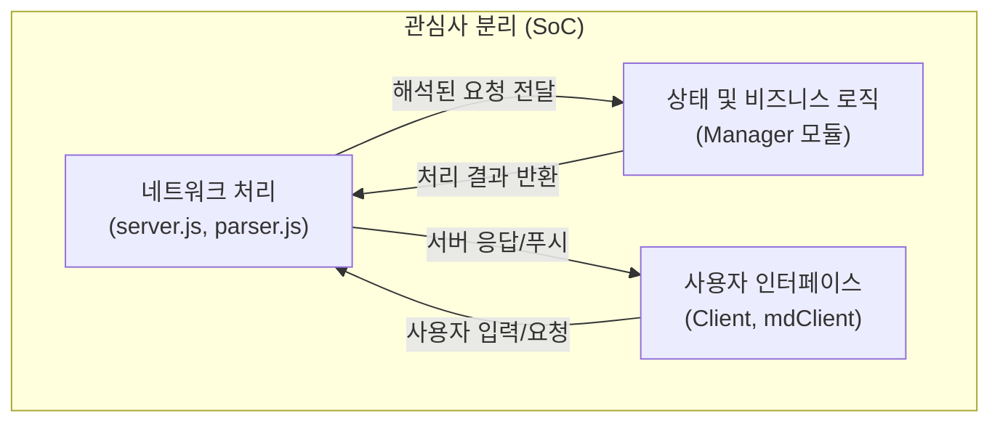

# 📝 Day18-19: TCP/UDP 쇼핑몰 서버 - 설계 및 코드 리뷰

## 1. 개요

이번 미션은 Node.js의 `net`과 `dgram` 모듈을 사용하여, 여러 클라이언트의 동시 접속과 상태를 관리하는 TCP 서버와 UDP 브로드캐스트 기능을 구현하는 것이 목표였습니다. 이 문서는 미션 요구사항 분석부터 최종 리팩토링까지, 전체 시스템의 설계 과정과 각 설계 결정 뒤에 숨은 이유를 상세히 설명합니다.

---

## 2. 상세 설계 과정: 요구사항부터 리팩토링까지

좋은 소프트웨어는 단순히 기능을 구현하는 것을 넘어, 변화에 유연하고 테스트하기 쉬우며, 다른 사람이 이해하기 좋은 구조를 가져야 합니다. 이러한 목표를 달성하기 위해 다음과 같은 단계별 설계 과정을 거쳤습니다.

### 2.1. 1단계: 기본 아키텍처 수립 (관심사 분리)

미션의 요구사항은 크게 **네트워크 통신 처리**, **클라이언트 상태 관리**, **비즈니스 로직 처리**라는 세 가지 영역으로 나눌 수 있었습니다. 만약 이 모든 것을 하나의 거대한 파일(`server.js`)에 구현한다면, 코드는 금방 복잡해지고 유지보수가 불가능한 상태가 될 것이라 판단했습니다.

따라서, **단일 책임 원칙(SRP, Single Responsibility Principle)** 에 따라 시스템의 역할을 명확히 분리하는 것을 최우선 목표로 삼았습니다.

-   **네트워크 계층 (`Server`, `Parser`):** 클라이언트와의 연결을 수락하고, 데이터 스트림을 의미있는 메시지로 변환하는 역할만 담당합니다. **"어떻게" 통신할 것인가**에만 집중합니다.
-   **상태/로직 계층 (`*Manager`):** `login`, `buy` 등 실제 요청을 처리하고, 서버가 기억해야 할 모든 데이터(세션, 그룹, 재고 등)를 관리합니다. **"무엇을" 할 것인가**에 집중합니다.
-   **표현 계층 (`Client`):** 사용자의 입력을 받고, 서버의 응답을 보여주는 역할에만 집중합니다.

이러한 구조는 각 모듈이 자신의 책임에만 집중하게 하여, 한 부분의 변경이 다른 부분에 미치는 영향을 최소화하고, 독립적인 테스트를 용이하게 만드는 기반이 됩니다.

### 2.2. 2단계: 안정적인 통신을 위한 프로토콜 설계 (`Protocol.js`, `parser.js`)

-   **문제 정의:** TCP는 데이터의 경계를 보장하지 않는 '스트림' 프로토콜입니다. 즉, `send("A"); send("B");`를 해도 수신측에서는 "AB"로 받을 수도, "A"와 "B"로 나누어 받을 수도, 심지어 "A"의 일부만 먼저 받을 수도 있습니다. 따라서 어디까지가 하나의 완전한 메시지인지 구분할 규칙, 즉 **애플리케이션 레벨 프로토콜**이 반드시 필요했습니다.

-   **설계 결정:**
    1.  **메시지 경계 식별:** 가장 보편적인 방법인 `Content-Length` 헤더 방식을 채택했습니다. 모든 메시지 앞에 `Content-Length: [길이]\r\n\r\n` 라는 헤더를 붙여, 수신측에서 메시지 본문의 정확한 길이를 미리 알 수 있도록 했습니다.
    2.  **데이터 구조 유연성:** 본문(payload)은 `JSON` 형식을 사용하기로 결정했습니다. 이는 `login`, `buy` 등 다양한 종류의 요청과 응답을 구조적으로 표현할 수 있고, 나중에 새로운 필드를 추가하기도 용이하기 때문입니다.
    3.  **책임 분리:** 이 프로토콜 규칙을 구현하는 로직을 별도의 모듈로 분리했습니다.
        -   **`Protocol.js`:** 메시지를 생성하는 역할(`formatRequest`, `formatResponse`). 메시지를 보낼 때 정해진 형식(헤더+JSON)으로 포장하는 책임만 집니다.
        -   **`parser.js`:** 메시지를 해석하는 역할. 들어오는 데이터 스트림(`Buffer`)을 분석하여 완전한 하나의 메시지를 추출해내는 책임만 집니다. `Buffer`를 직접 다루어 멀티바이트 문자나 데이터 분할 수신 문제에 안정적으로 대응하도록 설계했습니다.

### 2.3. 3단계: 상태 관리 전략 (`*Manager.js`)

서버는 여러 클라이언트의 상태를 동시에, 그리고 일관성 있게 관리해야 합니다. 각 상태의 성격에 맞춰 적절한 자료구조와 로직을 설계했습니다.

-   **`SessionManager.js`:**
    -   **요구사항:** 클라이언트 연결 관리, 로그인/로그아웃 처리, 중복 로그인 방지.
    -   **설계:**
        -   `sessions: Map<Socket, SessionInfo>`: 각 클라이언트의 `socket` 객체는 고유하므로, 이를 Key로 사용하여 해당 클라이언트의 모든 정보(`campId`, `groupId` 등)를 관리하는 `Map`을 사용했습니다. 이를 통해 특정 클라이언트의 정보를 O(1) 시간 복잡도로 빠르게 찾을 수 있습니다.
        -   `loggedInCampIds: Set<string>`: **중복 로그인을 막는 것이 핵심 요구사항**이었습니다. `campId`를 `Set`에 저장하여, 새로운 로그인 요청이 올 때마다 `Set.has()`를 통해 이미 접속 중인 ID인지 O(1)으로 매우 빠르게 확인할 수 있도록 했습니다.

-   **`GroupManager.js`:**
    -   **요구사항:** 최대 4명까지 그룹 자동 배정.
    -   **설계:**
        -   `groups: Map<GroupId, Set<CampId>>`: 그룹 ID를 Key로, 해당 그룹에 속한 캠퍼 ID 목록을 `Set`으로 관리합니다. `Set`을 사용하면 특정 캠퍼를 그룹에 추가하거나 제거하는 작업이 효율적입니다.
        -   **배정 로직:** 새로운 `joinGroup` 요청이 오면, `groups` 맵을 순회하며 `members.size < 4`인 그룹을 찾습니다. 빈 자리가 있으면 해당 그룹에 사용자를 추가하고, 없으면 `nextGroupId`를 증가시켜 새로운 그룹을 생성합니다. 이는 자원을 최대한 효율적으로 사용하려는 전략입니다.

### 2.4. 4단계: 재사용성과 테스트 용이성을 위한 리팩토링 (미션 2)

기능 구현 후, 코드를 더 유지보수하기 좋고 테스트하기 쉽게 만드는 구조 개선 작업을 진행했습니다.

-   **`BaseClient.js` 도입 (클라이언트 추상화):**
    -   **문제 인식:** `CustomerClient`와 `MdClient`는 명령어 파싱, 서버 통신 등 중복되는 코드가 많았습니다.
    -   **설계 개선:**
        1.  공통 로직(소켓 연결, 데이터 파싱, 메시지 전송)을 부모 클래스인 `BaseClient`로 옮겼습니다.
        2.  각 클라이언트의 `switch` 문으로 된 명령어 처리 로직을 **커맨드 패턴(Command Pattern)** 으로 개선했습니다. `BaseClient`에 `registerCommand(command, handler)` 메서드를 만들어, 각 자식 클라이언트가 "어떤 명령어(command)가 들어오면 어떤 동작(handler)을 할지"를 등록하게 했습니다. 이를 통해 `BaseClient`는 명령어 처리의 '방법'을, 각 클라이언트는 '내용'을 책임지게 되어 역할이 명확해졌습니다.

-   **싱글톤(Singleton) 패턴 제거:**
    -   **문제 인식:** 초기 Manager들은 `module.exports = new Manager()`와 같이 싱글톤으로 구현되었습니다. 이는 편리하지만, **테스트의 독립성을 심각하게 저해**합니다. 한 테스트 케이스가 수정한 Manager의 상태가 다른 테스트 케이스에 영향을 주어 예측 불가능한 테스트 결과를 낳기 때문입니다.
    -   **설계 개선:** 모든 Manager를 일반 클래스로 변경하고, `Server` 클래스의 생성자에서 `this.sessionManager = new SessionManager()`와 같이 **직접 인스턴스를 생성하여 사용(의존성 주입)**하도록 구조를 변경했습니다.
    -   **결과:** 이 변경 덕분에, 통합 테스트 시 `new Server()`를 호출할 때마다 서버는 자신만의 깨끗하고 독립적인 상태(Manager들)를 가진 인스턴스로 생성됩니다. 이를 통해 **테스트 간의 격리가 완벽하게 보장**되어 테스트의 신뢰도가 비약적으로 향상되었습니다.

-   **안정적인 비동기 테스트 환경 구축:**
    -   **문제 인식:** 네트워크 애플리케이션 테스트는 비동기 작업(연결, 종료, 메시지 수신)을 기다리는 것이 핵심입니다. 초기 테스트는 이를 제대로 처리하지 못해 Jest가 종료되지 않는 문제가 있었습니다.
    -   **설계 개선:** `Promise`를 적극적으로 활용했습니다. 예를 들어, `client.disconnect()`가 `Promise`를 반환하고 소켓의 `close` 이벤트가 발생했을 때 `resolve`되도록 수정했습니다. 테스트 코드에서는 `await client.disconnect()`를 통해 연결이 완전히 종료될 때까지 명시적으로 기다리게 하여, 모든 비동기 작업이 완료된 후 테스트가 깔끔하게 종료되도록 만들었습니다.

이러한 설계와 리팩토링 과정을 통해, 초기 요구사항을 만족시키는 것을 넘어 **변화에 유연하고, 테스트하기 쉬우며, 다른 사람이 이해하기 좋은** 견고한 코드 구조를 만들어나갈 수 있었습니다.