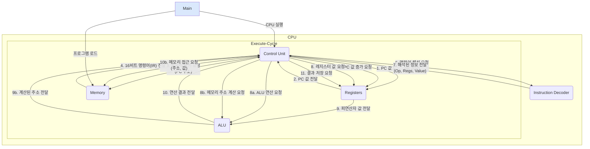

# Day20 CPU 시뮬레이터 개발 스펙

## 1. 스펙 (요구사항 분석)

이 문서는 주어진 요구사항을 바탕으로 CPU 시뮬레이터의 핵심 기능과 제약사항을 개발자 관점에서 재정의한 것입니다.

- **CPU 기본 단위:**
    - 모든 데이터 처리의 기본 단위(Word)는 **16비트(2바이트)** 입니다.

- **핵심 구성 요소:**
    - **레지스터 (Registers):**
        - 프로그램 카운터(PC): 다음에 실행할 명령어의 메모리 주소를 저장하는 레지스터. 1개.
        - 범용 레지스터 (R1-R7): 데이터나 메모리 주소를 임시로 저장하는 레지스터. 총 7개.
    - **산술 논리 장치 (ALU):**
        - 두 레지스터 값의 덧셈(`ADD`)과 뺄셈(`SUB`) 연산만 수행합니다.
    - **메모리 (Memory):**
        - CPU 외부에 존재하며, 프로그램 명령어와 데이터를 모두 저장합니다.
        - 특정 주소(e.g., `0x00A2`)에 특정 값이 미리 저장되어 있다고 가정하며, 간단한 `Map` 또는 `Dictionary` 형태로 구현 가능합니다.

- **CPU 명령어 세트 (Instruction Set):**
    - CPU는 16비트 길이의 다음 5가지 명령어만 처리합니다.
    - **`LOAD` (0001):** 메모리에서 레지스터로 데이터를 가져옵니다.
    - **`STORE` (0011):** 레지스터의 데이터를 메모리에 저장합니다.
    - **`ADD` (0111):** 두 레지스터의 값을 더해 결과 레지스터에 저장합니다.
    - **`SUB` (1010):** 레지스터와 상수 값을 빼서 결과 레지스터에 저장합니다.
    - **`MOV` (1011):** 상수 값을 레지스터에 저장합니다.

- **핵심 동작 (메서드):**
    - **`fetch()`:** PC 레지스터가 가리키는 주소의 메모리에서 16비트 명령어를 읽어온 후, PC 값을 1 증가시킵니다.
    - **`execute(instruction)`:** `fetch`로 가져온 명령어를 해석(decode)하고, 그에 맞는 연산(ALU 연산, 메모리 접근 등)을 수행합니다.

---

## 2. 상위 단위 타입과 데이터 구조

`main` 실행 흐름을 기준으로, 다음과 같은 최상위 타입들이 필요합니다.

-   **`CPU` (클래스):**
    -   시뮬레이션의 전체 흐름을 제어하는 핵심 클래스입니다.
    -   내부적으로 `Registers`, `ALU`, `Memory` 등 핵심 구성 요소의 인스턴스를 소유하고 관리합니다.
    -   `run(program)`과 같은 공개 메서드를 통해 프로그램 실행을 시작합니다.

-   **`Memory` (클래스):**
    -   프로그램 명령어와 데이터를 저장하는 메모리 공간입니다.
    -   주소(`number`)를 키로, 16비트 데이터(`number`)를 값으로 갖는 `Map` 또는 `Object` 형태로 구현할 수 있습니다.
    -   `read(address)`, `write(address, value)`와 같은 메서드를 제공합니다.

-   **`Registers` (클래스):**
    -   PC와 R1-R7 레지스터의 상태를 저장하고 관리합니다.
    -   레지스터 이름(`string`)을 키로, 16비트 데이터(`number`)를 값으로 갖는 `Map` 또는 `Object` 형태로 구현할 수 있습니다.
    -   `get(registerName)`, `set(registerName, value)`와 같은 메서드를 제공합니다.

-   **`InstructionDecoder` (모듈 또는 클래스):**
    -   16비트 명령어 코드를 CPU가 이해할 수 있는 구조(명령어 종류, 레지스터 번호, 상수 값 등)로 파싱(parsing)하는 책임을 가집니다.
    -   `decode(instruction)` 메서드는 16비트 숫자를 입력받아, `{ type: 'ADD', dst: 'R1', ... }` 와 같은 객체를 반환합니다.

---

## 3. 전체 구조와 데이터 흐름

CPU의 `run` 메서드가 호출되면, `fetch`와 `execute` 사이클이 반복적으로 실행됩니다. 전체적인 데이터 흐름은 다음과 같습니다.

1.  **Fetch (인출):**
    1.  제어 장치(Control Unit)가 `Registers`에서 현재 `PC` 값을 가져옵니다.
    2.  해당 `PC` 주소를 `Memory`에 전달하여 16비트 명령어를 읽어와 명령어 레지스터(IR)에 저장합니다.
    3.  `PC` 값을 1 증가시켜 다음 명령어를 가리키도록 합니다.
2.  **Decode (해석):**
    -   제어 장치는 `InstructionDecoder`에게 IR에 저장된 16비트 명령어를 전달하여 해석을 요청합니다.
    -   `InstructionDecoder`는 비트 연산을 통해 명령어의 종류, 대상 레지스터, 소스 레지스터, 상수 값 등을 추출하여 제어 장치에 반환합니다.
3.  **Execute (실행):**
    -   제어 장치는 해석된 정보에 따라 필요한 작업을 수행합니다.
    -   **산술 연산 (`ADD`, `SUB`):** `Registers`에서 피연산자 값을 가져와 `ALU`에 전달하여 연산을 요청하고, 결과를 다시 `Registers`의 목적지에 저장합니다.
    -   **메모리 접근 (`LOAD`, `STORE`):** `Registers`에서 주소 계산에 필요한 값을 가져와 유효 주소를 계산한 후, `Memory`에 데이터 읽기 또는 쓰기를 요청합니다.
    -   **데이터 이동 (`MOV`):** 명령어에 포함된 상수 값을 `Registers`의 목적지에 바로 저장합니다.
