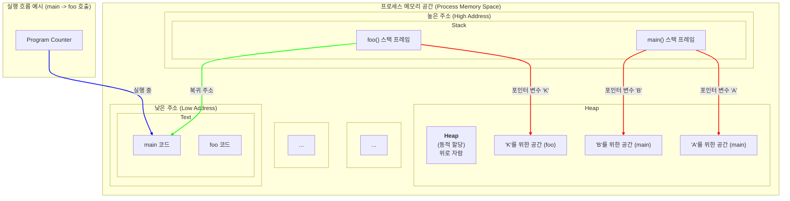

# 💻 Day4: 프로세스 메모리 모델 시뮬레이터

## 🚀 미션 목표

- 프로세스의 메모리 관리 모델(가상 메모리, 스택, 힙, 텍스트 영역 등)을 학습하고, 이를 기반으로 동작하는 시뮬레이터를 구현합니다.
- 어셈블리 형태의 명령어를 파싱하고 실행하여 메모리 변화를 추적하고, 프로그래밍 언어의 근본적인 동작 원리를 이해하는 것을 목표로 합니다.

## ✨ 미션 회고

이번 미션은 가비지 컬렉션(Phase 5)을 제외한 나머지 기능들을 구현하며 마무리했습니다. 비록 모든 요구사항을 완성하지는 못했지만, 구현 과정에서 마주친 한 가지 의문점, **"왜 포인터는 4바이트인데, 데이터는 8바이트로 정렬(패딩)해야 할까?"** 에 대한 깊은 탐구를 통해 컴퓨터 아키텍처의 핵심 원리를 학습하는 값진 경험을 했습니다. 단순한 코드 구현을 넘어, 시스템의 근본적인 동작 방식을 고민하고 논리적인 결론을 도출하는 과정 자체가 이번 미션의 가장 큰 수확이었다고 생각합니다.

---

## 📚 학습 및 설계 과정

시뮬레이터 구현에 앞서, 실제 운영체제와 프로그래밍 언어가 메모리를 어떻게 관리하고 사용하는지에 대한 깊은 이해가 필요했습니다.

아래 다이어그램은 시뮬레이터가 모방할 프로세스 메모리 구조와 `main` 함수에서 `foo` 함수를 호출할 때의 데이터 흐름을 시각적으로 나타냅니다.

### 1. 프로세스 메모리의 3가지 핵심 영역

프로세스의 메모리 공간은 크게 **Text, Stack, Heap** 세 영역으로 나뉩니다. 각 영역의 역할과 특징을 이해하는 것이 시뮬레이터 설계의 첫걸음이었습니다.

-   **Text (Code) 영역:** 작성된 코드가 기계어 형태로 저장되는 공간입니다. 프로그램 실행 중에 변경될 필요가 없으므로 **읽기 전용(Read-only)**으로 설정됩니다. 시뮬레이터에서는 `locate` 명령어로 들어온 코드들을 저장하는 역할을 합니다.
-   **Stack 영역:** 함수 호출과 관련된 데이터를 임시로 저장하는 공간입니다. 함수가 호출될 때마다 그 함수만의 작업 공간인 **스택 프레임(Stack Frame)**이 생성되고, 함수가 종료되면 사라지는 **LIFO(Last-In, First-Out)** 구조를 가집니다. 매우 빠르지만, 컴파일 타임에 크기가 결정되어 유연성이 떨어집니다.
-   **Heap 영역:** 프로그램 실행 중에 크기가 결정되지 않은 데이터를 동적으로 할당하기 위한 공간입니다. 개발자가 직접 `alloc(malloc)`으로 할당을 요청하고 `free`로 해제해야 합니다. 스택보다 느리지만, 필요에 따라 원하는 크기의 메모리를 유연하게 사용할 수 있어 객체, 배열 등 복잡한 데이터 구조를 저장하는 데 사용됩니다.

### 2. 함수 호출의 원리: 스택 프레임

`CALL`과 `RETURN` 명령어를 구현하기 위해, 함수 호출 시 스택에서 일어나는 일을 학습했습니다.

-   **스택 프레임(Stack Frame):** 함수 하나가 호출될 때마다, 그 함수에 필요한 정보(복귀 주소, 매개변수, 지역 변수 등)를 담는 독립적인 공간입니다.
-   **`CALL foo` 과정:**
    1.  `foo` 함수 실행이 끝나고 돌아와야 할 **복귀 주소(Return Address)**를 스택에 `push`합니다.
    2.  현재 함수의 스택 프레임 위치를 가리키는 **프레임 포인터(FP)**를 스택에 `push`하여 보존합니다.
    3.  `foo` 함수의 지역 변수(`VAR`)를 위한 공간을 스택에 확보합니다.
-   **`RETURN` 과정:**
    1.  `foo` 함수의 스택 프레임을 정리합니다.
    2.  스택에서 보존해 둔 이전 프레임 포인터를 `pop`하여 복원합니다.
    3.  스택에서 복귀 주소를 `pop`하여 **프로그램 카운터(PC)**에 넣음으로써 원래 흐름으로 돌아갑니다.

### 3. 아키텍처에 대한 고찰: 32비트 vs 64비트

가장 깊은 고민을 안겨준 부분입니다. **"4바이트 포인터"**와 **"8바이트 데이터 패딩"**이라는 두 제약 조건의 모순을 해결하는 과정에서 시스템 아키텍처의 핵심을 파고들었습니다.

-   **문제의 핵심:** 32비트 CPU(4바이트 Word) 환경에서 8바이트 데이터 처리는 메모리 접근을 두 번 필요로 하는 비효율의 극치입니다. 그렇다면 왜 이런 요구사항이 나왔을까요?
-   **결론:** 이 시스템은 **"64비트 CPU를 가지지만, 주소 버스(Address Bus)는 32비트여서 주소 공간이 4GB로 제한된 하이브리드 아키텍처"**라는 결론을 내렸습니다.
    -   **데이터 처리:** 64비트 CPU와 데이터 버스로 8바이트 데이터를 한 번에 효율적으로 처리합니다. (**8바이트 패딩의 이유**)
    -   **주소 지정:** 32비트 주소 버스로 4GB 내의 메모리 주소를 지정합니다. (**4바이트 포인터의 이유**)
-   이 결론은 실제 컴퓨터 시스템이 성능, 비용, 호환성 등 다양한 요소를 고려하여 어떻게 설계되는지에 대한 깊은 이해를 주었습니다.

---

## 🛠️ 상세 구현 과정

위 학습 내용을 바탕으로 시뮬레이터의 각 기능을 다음과 같이 구체적으로 구현했습니다.

### Phase 1: 기반 설계 및 초기화

-   **메모리 시뮬레이션:** `ArrayBuffer`를 사용하여 연속적인 바이트 배열로 전체 메모리 공간을 만들고, `DataView`를 통해 특정 주소에 원하는 타입(e.g., 32비트 정수, 64비트 부동소수점)으로 값을 읽고 쓰는 저수준 메모리 조작을 구현했습니다. 이는 C/C++과 유사한 환경을 제공합니다.
-   **타입 관리:** `setSize`로 정의된 타입(`INT`, `BOOL` 등)과 크기는 `Map` 객체에 저장하여, `alloc` 시 필요한 메모리 크기를 동적으로 계산하는 데 사용했습니다.

### Phase 2: 코드 및 데이터 적재

-   **함수 위치 관리:** `locate` 명령어로 들어온 코드들은 `TEXT` 영역에 순차적으로 저장됩니다. 이때, 함수 이름과 코드가 시작되는 `TEXT` 영역의 주소(인덱스)를 `Map` 객체에 `{ "main": 0, "foo": 24 }` 와 같이 매핑하여 `CALL` 시 해당 함수의 위치로 즉시 점프할 수 있도록 구현했습니다.

### Phase 3: 기본 명령어 처리

-   **`VAR A: TYPE`:**
    1.  `types` 맵에서 `TYPE`의 크기를 조회합니다.
    2.  `alloc`을 호출하여 힙 영역에 해당 크기의 메모리 블록을 할당받고, 시작 주소를 반환받습니다.
    3.  반환받은 힙 주소(포인터)를 스택에 `push`하여 변수 `A`에 할당된 메모리를 가리키도록 합니다.
-   **`SET A = 10`:**
    1.  변수 `A`에 해당하는 스택 위치에서 힙 포인터(주소)를 읽습니다.
    2.  `DataView.setFloat64()` (요구사항에 따라 8바이트 패딩)를 사용하여 해당 힙 주소에 값 `10`을 씁니다.
-   **`RELEASE A`:**
    1.  변수 `A`에 해당하는 스택 위치에서 힙 포인터를 읽습니다.
    2.  `free` 함수에 이 포인터를 전달하여 힙에 할당된 메모리 블록을 해제 상태로 변경합니다.

### Phase 4: 함수 호출 스택 구현

-   **`CALL foo`:**
    1.  **복귀 주소 저장:** 현재 `PC` 레지스터 값에 1을 더한 값(다음 명령어의 주소)을 스택에 `push`합니다.
    2.  **프레임 포인터 저장:** 현재 `FP` 레지스터 값을 스택에 `push`합니다.
    3.  **프레임 포인터 업데이트:** `FP`를 현재 `SP` 값으로 변경하여 `foo` 함수의 새로운 스택 프레임의 시작점을 설정합니다.
    4.  **점프:** `functions` 맵에서 "foo"의 시작 주소를 찾아 `PC`를 그 값으로 변경합니다.
-   **`RETURN 10`:**
    1.  **반환 값 저장:** 값 `10`을 특수 목적 레지스터인 `$RETURN`에 저장합니다.
    2.  **스택 프레임 복원:** `SP`를 현재 `FP` 값으로 되돌려, 현재 함수의 스택 프레임을 통째로 버립니다.
    3.  **프레임 포인터 복원:** 스택에서 이전 `FP` 값을 `pop`하여 `FP` 레지스터를 복원합니다.
    4.  **프로그램 카운터 복원:** 스택에서 복귀 주소를 `pop`하여 `PC` 레지스터를 복원함으로써 프로그램 흐름을 되돌립니다.

---

## 📝 미완성 기능 및 향후 과제

### Phase 5: 가비지 컬렉션 (Garbage Collection)

이번 미션에서 완성하지 못한 가비지 컬렉션은 향후 꼭 도전해보고 싶은 과제입니다. `학습내용.md`에 정리한 **Mark-and-Sweep** 알고리즘을 기반으로 구현을 계획해볼 수 있습니다.

-   **구현 아이디어 (Mark-and-Sweep):**
    1.  **Mark (표시) 단계:** 스택 영역을 처음부터 끝까지 스캔합니다. 스택에 저장된 모든 값은 힙 메모리를 가리키는 '포인터'로 간주합니다. 이 포인터들이 가리키는 힙 블록들을 모두 "살아있음(marked)"으로 표시합니다.
    2.  **Sweep (제거) 단계:** 전체 힙 영역을 순회하며, "살아있음" 표시가 없는 모든 메모리 블록을 "사용 가능(free)" 상태로 변경하여 메모리를 회수합니다.

이 과정을 통해, 스택에서의 참조가 사라진 고아 객체(Orphaned Object)들을 자동으로 정리하여 메모리 누수를 방지할 수 있을 것입니다.

