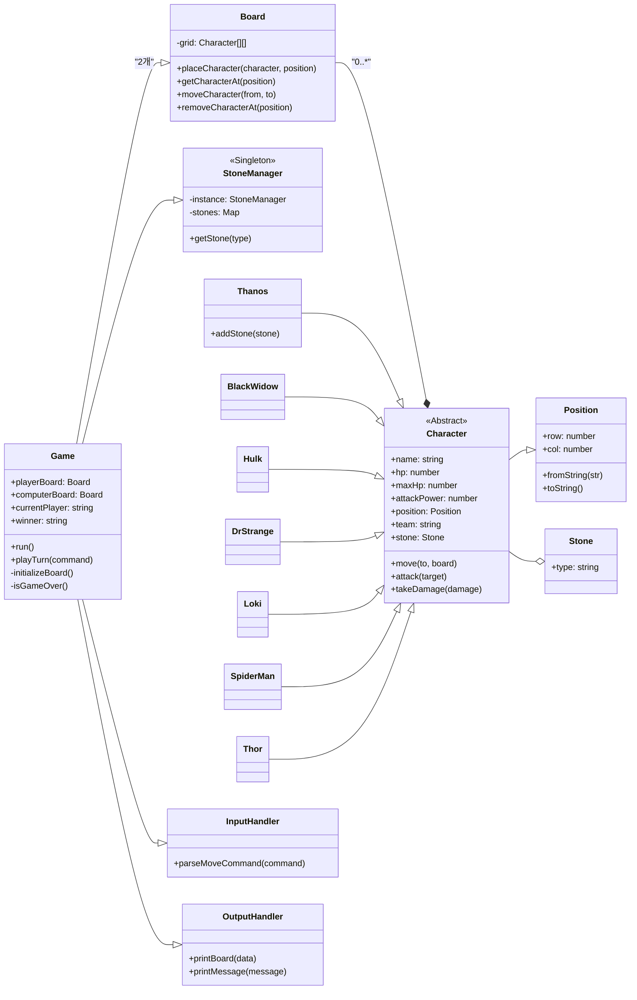

# 🎲 Day 6: 마블 보드게임 - 객체지향 프로그래밍

## 🎯 목표

> 객체지향 설계 원칙(SRP, 캡슐화 등)을 적용하여 유연하고 확장 가능한 마블 보드게임을 구현합니다. 각 캐릭터의 고유한 속성과 행동을 클래스로 정의하고, 클래스 간의 상호작용을 통해 게임의 핵심 로직을 완성하는 것을 목표로 합니다.

---

## 🧩 객체지향 설계

### 클래스 다이어그램

게임의 핵심 클래스 간의 관계는 다음과 같이 설계되었습니다. `Game` 클래스가 전체 흐름을 관리하며, 각 팀의 `Board`와 캐릭터(`Character` 및 자식 클래스)들을 생성하고 조작합니다. `StoneManager`는 스톤의 유일성을 보장하는 역할을 담당하며, `InputHandler`와 `OutputHandler`는 각각 사용자 입력 처리와 결과 출력을 책임져 SRP(단일 책임 원칙)를 따릅니다.

### 클래스별 역할

-   **Game**: 게임의 시작, 턴 관리, 종료 조건 확인 등 전체적인 흐름을 제어하는 메인 클래스입니다.
-   **Board**: 5x6 크기의 게임 보드를 나타냅니다. 캐릭터의 배치, 이동, 탐색 등 보드와 관련된 모든 기능을 담당합니다.
-   **Character**: 모든 캐릭터의 기본이 되는 추상 클래스입니다. HP, 공격력, 팀 등 공통 속성과 `move`, `attack`과 같은 기본 행동을 정의합니다.
-   **캐릭터 자식 클래스 (Thanos, Hulk 등)**: `Character`를 상속받아 각자 고유의 HP, 공격력, 이동 규칙을 구현합니다.
-   **Position**: 보드 위의 위치(행, 열)를 관리하는 데이터 구조입니다.
-   **Stone & StoneManager**: 스톤의 종류를 정의하고, 게임 내에서 각 스톤이 유일한 인스턴스를 갖도록 관리합니다.
-   **InputHandler / OutputHandler**: SRP 원칙에 따라, 사용자 입력 처리와 콘솔 출력 기능을 각각 분리하여 담당합니다.

---

## 💻 구현 과정 및 전략

1.  **1단계: 기본 클래스 구조 설계 및 구현**
    -   게임의 핵심 요소인 `Game`, `Board`, `Character`, `Position`, `Stone` 클래스의 기본 속성과 메서드를 정의했습니다.
    -   `Character`는 추상 클래스로 만들어, 각 캐릭터가 상속받아 자신만의 `move` 메서드를 반드시 구현하도록 강제했습니다.

2.  **2단계: 스톤 유일성 보장 리팩토링**
    -   "모든 스톤은 게임 전체에서 단 1개씩만 존재한다"는 요구사항을 만족시키기 위해 `StoneManager`를 도입했습니다.
    -   싱글턴 패턴을 적용하여 `StoneManager`가 모든 스톤 객체를 최초 1회만 생성하고, 이후에는 `getStone(type)` 메서드를 통해 이미 생성된 인스턴스를 반환하도록 구현했습니다.
    -   기존에 `new Stone()`으로 객체를 생성하던 `Game` 클래스의 코드를 `StoneManager.getStone()`을 사용하도록 수정했습니다.

3.  **3단계: 게임 종료 조건 수정 및 적용**
    -   기존의 "한쪽 팀의 모든 캐릭터가 사라지면 종료"라는 조건에서 "상대방의 타노스를 모두 제거하면 승리"하는 조건으로 변경했습니다.
    -   `Game` 클래스의 `_isGameOver()` 메서드를 수정하여, 매 턴마다 각 보드에 `Thanos` 캐릭터가 존재하는지 확인하도록 로직을 변경했습니다.
    -   승패 판정 후, `winner` 속성에 승리한 팀을 기록하고 게임 종료 메시지를 출력하도록 `_gameLoop()`를 수정했습니다.

4.  **4단계: 자동화된 테스트 스크립트 작성 및 디버깅**
    -   사용자 입력 없이 게임의 핵심 로직(캐릭터 생성, 공격, 이동, 종료)을 검증하기 위해 `test_game.js` 파일을 작성했습니다.
    -   테스트 스크립트는 `Game` 객체를 생성하고, 미리 정의된 또는 동적으로 생성된 명령어를 순차적으로 실행하며 게임을 진행시킵니다.
    -   이 과정을 통해 아래 '트러블슈팅' 섹션에 기술된 여러 버그와 로직 오류를 발견하고 수정할 수 있었습니다.

---

## 🔧 트러블슈팅

### 1. `Maximum call stack size exceeded` (스택 오버플로우)

-   **문제 원인**:
    -   초기 테스트 스크립트에서 `readline` 인터페이스를 모의(mock) 함수로 만들고, 그 안에서 게임의 메인 루프(`_gameLoop`)를 다시 호출했습니다.
    -   `_gameLoop`는 비동기적인 사용자 입력을 기다리도록 설계되었으나, 테스트 코드는 이를 동기적으로 즉시 호출하여 자기 자신을 계속해서 호출하는 무한 재귀에 빠졌습니다.
-   **해결 과정**:
    -   `readline` 모의 함수가 게임 루프를 직접 호출하는 구조를 제거했습니다.
    -   대신, 테스트 스크립트 내에 `while` 루프를 만들어 `game.playTurn()` 메서드를 순차적으로 호출하는 방식으로 변경하여, 비동기 로직을 동기적인 테스트 흐름으로 제어했습니다.

### 2. 컴퓨터 턴에서 테스트가 멈추는 현상

-   **문제 원인**:
    -   테스트 스크립트의 로직(`_generateCommand`)이 상대방(플레이어)을 공격하는 명령어만 생성할 수 있었습니다.
    -   만약 컴퓨터의 캐릭터가 이동 규칙상 플레이어의 어떤 캐릭터도 공격할 수 없는 위치에 있는 경우, AI는 유효한 명령을 생성하지 못하고 `null`을 반환하여 테스트가 그대로 멈췄습니다.
-   **해결 과정**:
    -   `_generateCommand` 함수에 새로운 로직을 추가했습니다.
    -   만약 공격할 대상을 찾지 못하면, **자신의 보드에서 비어있는 무작위 위치를 찾아 그곳으로 이동하는** 명령을 생성하도록 수정했습니다. 이를 통해 컴퓨터 턴이 막히는 일 없이 게임이 계속 진행될 수 있었습니다.
