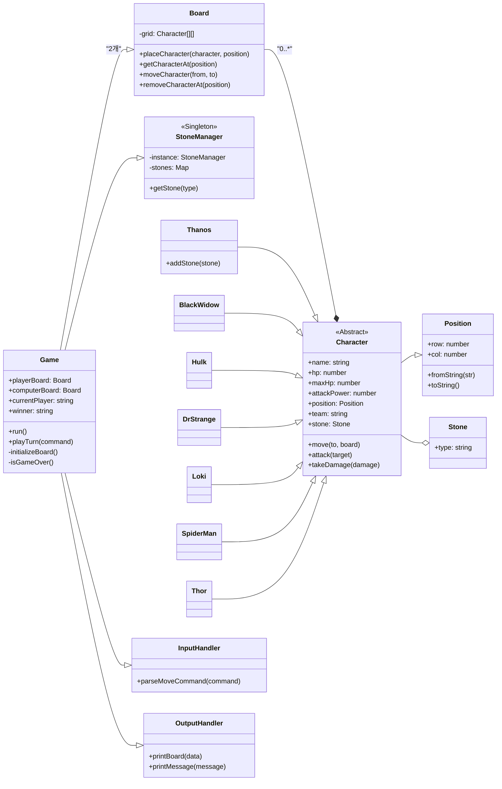

# 학습내용

## 객체지향의 기본 개념 이해

OOP는 현실 세계의 사물(객체)를 모델링하여 프로그램을 구성하는 방법이다. 주요 개념은 다음과 같다

| 개념 | 설명 |
| --- | --- |
| **클래스(Class)** | 객체를 만들기 위한 **설계도** 또는 **청사진**입니다. 속성(변수)과 행동(메서드)을 정의합니다. |
| **객체(Object)** | 클래스에서 생성된 **구체적인 실체**입니다. 실제 메모리에 존재하는 데이터입니다. |
| **인스턴스(Instance)** | 어떤 클래스의 객체를 말합니다. 즉, "인스턴스 = 클래스의 객체"입니다. (동의어처럼 사용됨) |
| **캡슐화(Encapsulation)** | 데이터(속성)와 메서드(행동)를 하나로 묶고, 외부에서 직접 접근하지 못하도록 보호하는 것 |
| **상속(Inheritance)** | 기존 클래스의 속성과 행동을 **물려받아** 새로운 클래스를 만드는 것 |
| **다형성(Polymorphism)** | 동일한 인터페이스로 여러 타입의 객체를 다룰 수 있는 성질 (ex: 오버라이딩, 오버로딩 등) |

### 클래스, 객체, 인스턴스의 관계 및 비교

| 항목 | 클래스(Class) | 객체(Object) | 인스턴스(Instance) |
| --- | --- | --- | --- |
| 정의 | 객체를 생성하기 위한 **설계도** | 클래스에 따라 생성된 **실체** | 클래스에 의해 생성된 **객체 (동일 개념)** |
| 역할 | 틀(Template) | 실제 동작하는 주체 | 객체와 같음 |
| 예시 | 붕어빵 틀 | 만들어진 붕어빵 | 그 붕어빵 자체 |
| 메모리 | 정의만 있고 메모리에 올라가지 않음 | 메모리에 올라감 | 메모리에 올라감 |
| 관계 | 객체를 만들기 위한 기반 | 클래스에 의해 생성됨 | 클래스의 객체 == 인스턴스 |

**객체와 인스턴스는 거의 같은 뜻**으로 쓰이지만, **문맥상 차이**가 있을 수 있다.

- `a = Person()`에서 `a`는 Person 클래스의 **인스턴스이자 객체**입니다.
- "객체"는 더 일반적인 용어, "인스턴스"는 특정 클래스에서 생성됐다는 맥락을 강조할 때 사용합니다.

### 프로퍼티

- 객체가 가지는 데이터(속성)입니다.
- 클래스 내부에서 변수(필드)로 정의되며, 인스턴스마다 개별 값을 가질 수 있습니다.
- **"명사적인 개념"** (이름, 나이, 색상 등)

```jsx
let person = {
    name : 'bigone',
    age : 30
}
```

### 메서드

- 객체가 수행할 수 있는 동작(행위)입니다.
- 클래스 내부에 정의된 **함수**
- 객체의 **프로퍼티를 활용하거나 변경**하는 기능을 가질 수 있습니다.
- **"동사적인 개념"** (짖다, 걷다, 먹다 등)

## 객체지향의 3대 특징 파악

### ✅ 1. 캡슐화 (Encapsulation)

> 객체의 속성(Hp, 위치 등)을 직접 수정하지 못하게 은닉(private)하고, **메서드로만 접근**하게 합니다.
> 

```jsx
class Character {
  #hp; // private 필드 (외부에서 직접 접근 불가)
  #position;

  constructor(hp, position) {
    this.#hp = hp;
    this.#position = position;
  }

  getHp() {
    return this.#hp;
  }

  move(dx, dy) {
    this.#position.x += dx;
    this.#position.y += dy;
  }

  takeDamage(dmg) {
    this.#hp = Math.max(0, this.#hp - dmg);
  }

  getPosition() {
    return { ...this.#position }; // 복사본 반환
  }
}

const hero = new Character(100, { x: 0, y: 0 });
hero.takeDamage(30);
console.log(hero.getHp()); // 70
hero.move(1, 0);
console.log(hero.getPosition()); // { x: 1, y: 0 }

// console.log(hero.#hp);  // ❌ Error: Private field
```

### 💡 캡슐화의 필요성

- 의도치 않은 데이터 변경을 막아 **안정성** 확보
- 정해진 메서드를 통해서만 변경 → **일관성** 유지

### ✅ 2. 상속 (Inheritance)

> 여러 캐릭터가 공통된 속성과 메서드를 Character 부모 클래스에서 상속받습니다.
> 

```jsx
class Character {
  constructor(name, hp, position) {
    this.name = name;
    this.hp = hp;
    this.position = position;
  }

  move(dx, dy) {
    this.position.x += dx;
    this.position.y += dy;
    console.log(`${this.name} moved to (${this.position.x}, ${this.position.y})`);
  }

  takeDamage(dmg) {
    this.hp = Math.max(0, this.hp - dmg);
    console.log(`${this.name} took ${dmg} damage. HP: ${this.hp}`);
  }
}

class Thor extends Character {
  constructor(position) {
    super("Thor", 150, position); // Character 생성자 호출
  }

  thunderAttack() {
    console.log("⚡ Thor unleashes thunder!");
  }
}

const thor = new Thor({ x: 0, y: 0 });
thor.move(2, 3);          // Thor moved to (2, 3)
thor.takeDamage(20);      // Thor took 20 damage. HP: 130
thor.thunderAttack();     // ⚡ Thor unleashes thunder!
```

### 💡 상속의 장점

- **중복 제거**: 공통 코드를 부모 클래스에 작성
- **유지보수 용이**: 부모 변경 시 자식에게 자동 반영

---

## ✅ 3. 다형성 (Polymorphism)

> 같은 이름의 메서드(move())가 객체의 종류에 따라 다르게 동작합니다.
> 

```jsx
class Character {
  constructor(name, position) {
    this.name = name;
    this.position = position;
  }

  move(dx, dy) {
    this.position.x += dx;
    this.position.y += dy;
    console.log(`${this.name} moved to (${this.position.x}, ${this.position.y})`);
  }
}

class BlackWidow extends Character {
  move(dx, dy) {
    // 상하좌우 이동
    super.move(dx, dy);
  }
}

class Loki extends Character {
  move(dx, dy) {
    // 대각선 이동
    this.position.x += dx;
    this.position.y += dx; // dx로 x, y 같이 이동
    console.log(`${this.name} diagonally moved to (${this.position.x}, ${this.position.y})`);
  }
}

const bw = new BlackWidow("BlackWidow", { x: 0, y: 0 });
const loki = new Loki("Loki", { x: 5, y: 5 });

const characters = [bw, loki];

characters.forEach(char => char.move(1, 1));
// BlackWidow moved to (1, 1)
// Loki diagonally moved to (6, 6)

```

### 💡 다형성의 장점

- 같은 인터페이스(메서드명)로 다양한 객체를 다룰 수 있음
- **확장성**이 좋고, **유지보수가 편함**

---

## JavaScript의 클래스와 프로토타입의 관계

### ✅ 자바스크립트는 **프로토타입 기반 언어**

자바스크립트는 본질적으로 **클래스 기반이 아니라 프로토타입 기반의 객체지향 언어**입니다.

ES6에서 `class` 문법이 도입되었지만, 내부적으로는 여전히 **프로토타입 체인**을 사용합니다.

---

## ✅ 프로토타입이란?

> 모든 객체는 자신을 생성한 생성자의 `prototype` 속성을 참조하여 **상속**을 구현합니다.
> 

```jsx
function Person(name) {
  this.name = name;
}

Person.prototype.sayHello = function() {
  console.log(`Hi, I'm ${this.name}`);
};

const p1 = new Person("Tony");
p1.sayHello(); // Hi, I'm Tony

```

- `sayHello()`는 `p1` 객체에 직접 정의된 것이 아니라 `Person.prototype`에 정의되어 있음.
- `p1`이 `sayHello()`를 호출하면, JS는 `p1 → Person.prototype → Object.prototype` 순으로 메서드를 찾음.
    
    이 연결 구조를 **프로토타입 체인**이라고 합니다.
    

---

### **✅ 클래스(class)와 프로토타입의 관계 (ES6)**

ES6에서 `class`는 문법적 설탕(Syntax sugar)일 뿐, **내부적으로는 여전히 프로토타입을 사용**합니다.

```jsx
class Hero {
  constructor(name) {
    this.name = name;
  }

  attack() {
    console.log(`${this.name} attacks!`);
  }
}

const h1 = new Hero("Spider-Man");
h1.attack(); // Spider-Man attacks!

console.log(h1.__proto__ === Hero.prototype); // true

```

- `h1` 객체는 `Hero` 클래스의 인스턴스이지만,
- 내부적으로는 `Hero.prototype`을 참조하는 **프로토타입 기반 객체**입니다.

## ✅ 프로토타입 체인 구조 예시

```
h1 → Hero.prototype → Object.prototype → null
```

- `h1`은 `attack()`을 가지고 있지 않으면 `Hero.prototype`에서 찾고,
- 거기에도 없으면 `Object.prototype`까지 올라가서 찾습니다.

| 비교 항목 | 클래스(class) | 프로토타입 기반 |
| --- | --- | --- |
| 문법 시작 | ES6 도입 (2015) | ES5 이전부터 존재 |
| 작성 방식 | `class`, `constructor`, `extends` 등 사용 | `function`과 `prototype` 직접 연결 |
| 내부 동작 | 결국 `prototype` 기반으로 동작 | 직접 `prototype` 조작 |
| 상속 구현 | `extends`, `super()` | `Object.create`, `__proto__` 또는 `prototype` 연결 |
| 직관성 | 직관적, 다른 OOP 언어와 유사 | JS 특유의 유연성과 복잡성 |

---

```jsx
class Character {
  constructor(name) {
    this.name = name;
  }

  attack() {
    console.log(`${this.name} attacks!`);
  }
}

```

```jsx
function Character(name) {
  this.name = name;
}

Character.prototype.attack = function() {
  console.log(this.name + " attacks!");
};

```

### ✅ 이것이 이번 과제에 중요한 이유: 메모리 효율성

> `class`의 메소드가 `prototype`에 저장된다는 사실은 메모리 효율성 측면에서 매우 중요합니다.
> 
> 
> 만약 우리가 Hulk 클래스의 인스턴스를 2개, Loki 클래스의 인스턴스를 3개 만든다고 가정해 봅시다.
> 

```jsx
const hulk1 = new Hulk();
const hulk2 = new Hulk();
const loki1 = new Loki();
const loki2 = new Loki();
const loki3 = new Loki();
```

이때, 각 캐릭터의 `move()`나 `attack()` 같은 메소드들은 각 인스턴스마다 새로 생성되는 것이 아닙니다. 대신, `Hulk.prototype`과 `Loki.prototype`에 단 한 번씩만 생성되고, 모든 인스턴스들이 이를 공유해서 사용합니다.

---

## 📖 챌린지 학습 점검 사항

### 1) 스스로 확인할 사항

#### 클래스, 오브젝트, 인스턴스

- **클래스(Class)**: "캐릭터"라는 개념을 정의한 **설계도**. 어떤 속성(HP, 공격력)과 행동(이동, 공격)을 가질지 명시하지만, 그 자체로 게임에 참여할 수는 없다.
- **오브젝트(Object)**: 설계도를 바탕으로 만들어진 **실체**. 게임에 등장하는 '헐크'나 '토르' 하나하나가 모두 오브젝트다. 이름, 현재 HP 등 자신만의 상태(State)를 가진다.
- **인스턴스(Instance)**: 특정 클래스로부터 생성된 오브젝트를 지칭할 때 사용한다. "이 헐크는 `Hulk` 클래스의 인스턴스다"처럼, 오브젝트와 클래스 사이의 관계를 명확히 할 때 주로 사용된다. 사실상 오브젝트와 거의 동일한 의미로 쓰인다.

#### 전체 클래스 다이어그램



#### 상속과 다형성

- **상속(Inheritance)**: `Character`라는 부모 클래스에 모든 캐릭터가 공통으로 가져야 할 `name`, `hp`, `attack`, `takeDamage` 등의 속성과 메서드를 정의했다. `Hulk`, `Thor` 같은 자식 클래스들은 `extends Character`를 통해 이 공통 기능들을 그대로 물려받아 코드 중복을 피할 수 있었다. 덕분에 공통 기능을 수정할 때 `Character` 클래스만 변경하면 모든 자식 클래스에 반영되는 이점을 얻었다.
- **다형성(Polymorphism)**: 모든 캐릭터는 `move()`라는 동일한 이름의 메서드를 가지고 있지만, 실제 동작 방식은 캐릭터마다 다르다. 예를 들어, `Hulk`의 `move()`는 상하 이동만 허용하는 반면, `Loki`의 `move()`는 대각선 이동만 허용한다. `Game` 클래스에서는 어떤 캐릭터 인스턴스인지 신경 쓰지 않고 단순히 `character.move()`를 호출하기만 하면, 해당 인스턴스의 클래스에 맞게 재정의(Override)된 `move()` 메서드가 실행된다. 이처럼 같은 호출에 대해 객체의 종류에 따라 다른 동작을 하는 것이 다형성의 핵심이다.

#### Class vs Struct

| 구분 | Class (클래스) | Struct (구조체) |
| --- | --- | --- |
| **기본 개념** | 객체를 만들기 위한 설계도. 속성(데이터)과 행동(메서드)을 함께 가진다. | 여러 변수를 묶는 사용자 정의 자료형. 주로 데이터 자체를 담는 데 집중한다. |
| **상속** | **가능**. 부모 클래스의 기능을 자식에게 물려줄 수 있다. | **불가능**. 다른 구조체를 상속받을 수 없다. |
| **메모리 할당** | **힙(Heap)** 영역에 할당. (참조 타입, Reference Type) | **스택(Stack)** 영역에 할당. (값 타입, Value Type) |
| **전달 방식** | 변수에는 객체의 메모리 주소(참조)가 저장된다. 함수에 전달 시 **참조에 의한 전달(Pass-by-Reference)**. | 변수에 실제 값이 그대로 저장된다. 함수에 전달 시 값이 복사되는 **값에 의한 전달(Pass-by-Value)**. |
| **언어** | Java, C++, Python, **JavaScript** 등 대부분의 객체지향 언어 | C, C++, Swift, Go 등 |

> **JavaScript에는 `Struct` 키워드가 없다.** 하지만 `Object`를 사용하여 값의 묶음을 표현하는 등 구조체와 유사한 방식으로 데이터를 다룰 수 있다.

#### self vs super

- **self (또는 this)**: **현재 인스턴스 자신**을 가리키는 키워드다. 클래스 내에서 자신의 다른 속성이나 메서드에 접근할 때 사용한다. 예를 들어, `Character` 클래스의 `takeDamage` 메서드에서 `this.hp`는 현재 데미지를 입는 캐릭터 인스턴스의 `hp` 속성을 의미한다.
- **super**: **부모 클래스**를 가리키는 키워드다. 자식 클래스에서 부모 클래스의 생성자나 메서드를 호출할 때 사용한다. 이번 프로젝트에서 `Hulk` 클래스의 `constructor` 내부에서 `super(...)`를 호출하여 부모인 `Character` 클래스의 생성자를 실행하고 기본 속성을 초기화했다. 또한, 부모의 메서드를 확장할 때 `super.move()`와 같이 사용하여 부모의 원래 기능을 먼저 실행하고 자식의 추가 기능을 덧붙일 수 있다.

### 2) 다같이 확인할 사항

#### 객체 인스턴스 비교 방법

- **`==` (동등 연산자)**: 두 피연산자의 **값이 같도록 변환**하여 비교한다. 객체에 사용하면 두 변수가 **같은 메모리 주소를 참조하는지** 확인한다. (의도치 않은 형 변환 때문에 사용을 권장하지 않음)
- **`===` (일치 연산자)**: **형 변환 없이** 두 피연산자의 값과 타입이 모두 같은지 비교한다. 객체에 사용 시 `==`와 동일하게 두 변수가 같은 메모리 주소를 참조하는지 확인한다. **가장 빠르고 명확한 참조 비교 방법**이다.
- **`instanceof`**: 특정 객체가 어떤 클래스(생성자)의 인스턴스인지 확인할 때 사용한다. `hulk instanceof Character`는 `true`를 반환한다.
- **속성 값 비교 (Deep-equal)**: 객체의 참조가 아닌, 내부 속성 값들이 모두 같은지 재귀적으로 비교하는 방식이다. Lodash 라이브러리의 `_.isEqual()` 함수가 대표적이다. 두 객체가 메모리상으로는 다르지만 내용이 완전히 같다면 `true`를 반환한다. 참조 비교보다 훨씬 느리지만 내용 비교가 필요할 때 사용한다.

> **효율성**: 단순 참조 비교는 `===`가 가장 빠르다. 객체의 내용까지 모두 비교해야 한다면 `_.isEqual()` 같은 깊은 비교가 필요하지만, 성능 비용이 크므로 꼭 필요한 경우에만 사용해야 한다.

#### SOLID 원칙: SRP (단일 책임 원칙)

- **정의**: **하나의 클래스는 하나의 책임만 가져야 한다.** 즉, 클래스를 변경해야 하는 이유는 단 하나뿐이어야 한다.
- **적용 사례**: 이번 프로젝트에서 `InputHandler`와 `OutputHandler`를 분리한 것이 대표적인 SRP 적용 사례다. 만약 `Game` 클래스가 사용자 입력 처리와 콘솔 출력 기능까지 모두 담당했다면, 입력 방식이 바뀌거나(예: 웹 인터페이스로 변경) 출력 형식이 바뀔 때마다 `Game` 클래스를 수정해야 했을 것이다. 각 클래스가 '입력', '출력'이라는 단 하나의 책임만 맡도록 분리함으로써, 변경의 파급 효과를 줄이고 코드의 유지보수성을 높였다.

#### SOLID 원칙: LSP (리스코프 치환 원칙)

- **정의**: **자식 클래스는 언제나 부모 클래스의 인스턴스로 대체될 수 있어야 한다.** 즉, 부모 클래스를 사용하는 코드가 자식 클래스의 인스턴스를 사용하더라도 문제없이 동작해야 한다.
- **적용 사례**: `Game` 클래스는 `Character` 타입의 배열을 다룬다. 이 배열에는 `Hulk`, `Thor`, `Loki` 등 다양한 자식 클래스의 인스턴스가 들어간다. `Game` 클래스는 각 객체가 `Hulk`인지 `Thor`인지 구체적으로 알 필요 없이, `Character`에 정의된 `move()`, `attack()` 메서드를 호출한다. 각 자식 클래스는 이 메서드들을 자신에 맞게 재정의(Override)했지만, **메서드의 기본 기능(이동, 공격)과 매개변수 형식은 부모 클래스와 동일하게 유지**했다. 만약 `Hulk`의 `move` 메서드가 갑자기 다른 형식의 매개변수를 요구했다면, `Game` 클래스는 `Hulk` 인스턴스를 만났을 때 오류를 발생시켰을 것이다. 이처럼 LSP를 준수했기 때문에 `Game` 클래스는 캐릭터의 구체적인 종류에 의존하지 않고 일관된 방식으로 모든 캐릭터를 다룰 수 있었다.
